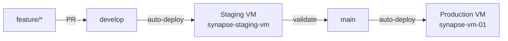

# ADR-0004: Branch-per-Environment Deployment Model

## Status

Accepted

## Date

2026-03-01

## Context

With the introduction of a staging VM (`synapse-staging-vm`) alongside the existing production VM (`synapse-vm-01`), we need a clear deployment strategy that maps Git branches to environments. The two main options considered were:

1. **Branch-per-environment** — each environment tracks a dedicated branch (`develop` for staging, `main` for production)
2. **Single-branch promotion** — both environments deploy from `main`, with a manual gate between staging and production

The project already follows GitFlow with `develop` as the integration branch where all PRs merge, and `main` as the production-ready branch.

## Decision

We adopt the **branch-per-environment** deployment model:

| Branch | Environment | Trigger |
|--------|-------------|---------|
| `develop` | Staging (`synapse-staging-vm`) | Auto-deploy on merge to `develop` |
| `main` | Production (`synapse-vm-01`) | Auto-deploy on merge to `main` |

### Diagram

### Deployment Flow

1. Feature branches merge into `develop` via PR
2. Merges to `develop` auto-deploy to the staging VM
3. After validation on staging, `develop` is merged to `main` via PR
4. Merges to `main` auto-deploy to the production VM

The deploy workflow (`deploy.yml`) resolves the target branch from the environment: `prod` resets to `origin/main`, all others reset to `origin/develop`.

## Consequences

### Positive

- Staging validates code before it reaches `main`, catching issues early
- Aligns naturally with the existing GitFlow branching model
- Each environment has a predictable, deterministic state
- Feature branches can be tested on staging without affecting production

### Negative

- Requires maintaining two deploy targets (two sets of GitHub Actions environment secrets)
- `develop` and `main` can diverge if staging validation is delayed
- Every merge to `develop` triggers a deployment, which may be noisy for high-frequency PR merges
