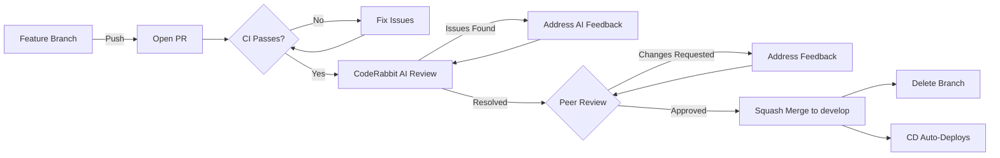

# Pull Request Best Practices

> Best practices for creating, reviewing, and merging pull requests in Network Synapse.

## PR Lifecycle

```text
feature branch → open PR → CI validates → CodeRabbit AI review → peer review → merge to develop → CD deploys
```

## Creating a Pull Request

### 1. Keep PRs Small and Focused

- **One feature or fix per PR** — avoid combining unrelated changes
- Aim for **< 400 lines changed** — large PRs get rubber-stamped, not reviewed
- If a feature is large, split it into stacked PRs (base → incremental layers)

### 2. Branch from `develop`

```bash
git checkout -b feature/<description> develop
```

See [git-workflow.md](../guidelines/git-workflow.md) for branch naming conventions.

### 3. Run Quality Checks Before Opening

```bash
uv run invoke check-all          # Lint + format + security scan
uv run invoke backend.test-unit  # Unit tests
```

> [!CAUTION]
> Never open a PR that fails local checks. CI will reject it and waste review cycles.

### 4. Rebase or Merge Target Branch First

```bash
git fetch origin
git rebase origin/develop        # Preferred — keeps linear history
# OR
git merge origin/develop         # If rebase is complex
```

Resolve all conflicts **before** opening the PR.

### 5. Fill Out the PR Template

Every PR uses the [PR template](../../.github/pull_request_template.md). Fill out **all** sections:

| Section           | What to Write                                               |
| ----------------- | ----------------------------------------------------------- |
| **Why**           | The problem being solved. Link the issue (`Closes #42`)     |
| **What Changed**  | Behavioral changes, not a file list                         |
| **How to Review** | Key files, risky areas, alternatives you considered         |
| **How to Test**   | Exact commands and expected output                          |
| **Impact**        | Check backward compat, new deps, config changes, migrations |
| **Checklist**     | Tests, lint, changelog fragment, docs — tick all that apply |

### 6. Use a Descriptive Title

Use Conventional Commits format in the PR title:

```text
feat: add BGP session validation activity
fix: handle timeouts in schema loader (#42)
docs: update infrastructure connection guide
```

This becomes the squash merge commit message when the PR is merged.

## Reviewing Pull Requests

### AI Code Review (CodeRabbit)

Every PR automatically receives an AI review from [CodeRabbit](https://coderabbit.ai) shortly after it is opened. It posts:

- A **PR summary** — high-level walkthrough of what changed and why
- **Inline comments** — specific issues, suggestions, and improvements per file

**How to interact with CodeRabbit:**

| Command (in PR comment) | Effect                                        |
| ----------------------- | --------------------------------------------- |
| `@coderabbitai review`  | Trigger a fresh review                        |
| `@coderabbitai summary` | Regenerate the PR summary                     |
| `@coderabbitai resolve` | Mark a thread as resolved                     |
| `@coderabbitai ignore`  | Tell it to stop commenting on this file/issue |

**What to do with AI comments:**

- **Fix obvious issues** (bugs, missing type hints, security flags) before requesting human review
- **Dismiss non-issues** with a brief reply explaining why — e.g. _"intentional — this activity stub will be implemented in #45"_
- You do **not** need to address every stylistic nitpick — use your judgement

> [!TIP]
> Addressing CodeRabbit's comments before requesting human review leads to faster, higher-quality peer review cycles.

### For Human Reviewers

- **Review within 24 hours** — don't let PRs go stale
- **Focus on logic and design**, not just style (Ruff handles formatting)
- **Be specific** — suggest code, not just "this doesn't look right"
- **Approve with comments** when changes are minor and optional
- **Request changes** only for correctness, security, or breaking issues
- Use GitHub's suggestion feature for small fixes:

````markdown
```suggestion
corrected_line = "example"
```
````

### For Authors

- **Respond to every comment** — resolve or explain
- **Don't force-push during review** — it destroys comment context
- **Add follow-up commits** during review, squash on merge

## Merging Strategy

| Rule                   | Details                                      |
| ---------------------- | -------------------------------------------- |
| **Merge method**       | Squash merge (one clean commit per PR)       |
| **Required approvals** | At least 1 (configure in branch protection)  |
| **CI must pass**       | All status checks green before merge         |
| **Branch up-to-date**  | Must be current with `develop` before merge  |
| **Delete branch**      | Always delete the feature branch after merge |

## PR Size Guidelines

| Size      | Lines Changed | Expected Review Time   |
| --------- | ------------- | ---------------------- |
| 🟢 Small  | < 100         | < 30 minutes           |
| 🟡 Medium | 100–400       | 30–60 minutes          |
| 🔴 Large  | 400+          | Split into smaller PRs |

## PR Checklist (Quick Reference)

Before opening:

- [ ] Branch is up-to-date with `develop`
- [ ] `uv run invoke check-all` passes
- [ ] `uv run invoke backend.test-unit` passes
- [ ] PR title uses Conventional Commits format
- [ ] PR template is filled out completely
- [ ] Changelog fragment added (if user-facing change)
- [ ] Documentation updated (if applicable)

Before merging:

- [ ] CI is green
- [ ] CodeRabbit comments addressed (or replied to with reasoning)
- [ ] At least 1 human approval received
- [ ] All review comments addressed
- [ ] Branch conflicts resolved

## Recommended Branch Protection Rules

Configure these in GitHub → Settings → Branches → Branch protection rules for `main` **and** `develop`:

- ✅ Require pull request reviews before merging (1 approval minimum)
- ✅ Require status checks to pass before merging
- ✅ Require branches to be up to date before merging
- ✅ Require conversation resolution before merging
- ✅ Do not allow bypassing the above settings
- ✅ Automatically delete head branches

## Flow Diagram



## Related Documents

- [Git Workflow](../guidelines/git-workflow.md) — Branch strategy, commit conventions
- [PR Template](../../.github/pull_request_template.md) — The actual PR form
- [CONTRIBUTING.md](../../CONTRIBUTING.md) — Getting started as a contributor
- [AGENTS.md](../../AGENTS.md) — GitOps rules for AI agents
