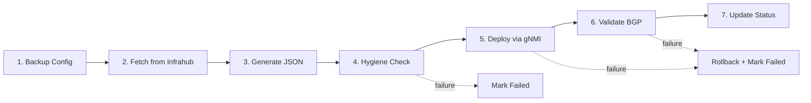

# Week 3 Walkthrough: Deployment & Validation

All 7 GitHub issues from the **Week 3: Deployment + Validation** milestone have been implemented. The full `check-all` quality pipeline passes with **zero errors**.

---

## Changes Made

### Issue #18 & #19 — Config Deployment via pygnmi

| File                                                                                                                                                           | Change                                                                                             |
| -------------------------------------------------------------------------------------------------------------------------------------------------------------- | -------------------------------------------------------------------------------------------------- |
| [deploy_configs.py](file:///Users/anton/PYPROJECTS/project-network-synapse-3/backend/network_synapse/scripts/deploy_configs.py)                                | Implemented `deploy_config()` and `validate_gnmi_connection()` using `pygnmi`                      |
| [config_deployment_activities.py](file:///Users/anton/PYPROJECTS/project-network-synapse-3/workers/synapse_workers/activities/config_deployment_activities.py) | Temporal activities wrapping the pygnmi deploy + rollback                                          |
| [device_backup_activities.py](file:///Users/anton/PYPROJECTS/project-network-synapse-3/workers/synapse_workers/activities/device_backup_activities.py)         | gNMI GET-based config backup before deployment                                                     |
| [network_change_workflow.py](file:///Users/anton/PYPROJECTS/project-network-synapse-3/workers/synapse_workers/workflows/network_change_workflow.py)            | Full 7-step orchestration: Backup → Fetch → Generate → Hygiene → Deploy → Validate → Status Update |

### Issue #20 — Suzieq Telemetry

| File                                                                                                                     | Change                                             |
| ------------------------------------------------------------------------------------------------------------------------ | -------------------------------------------------- |
| [docker-compose-deps.yml](file:///Users/anton/PYPROJECTS/project-network-synapse-3/development/docker-compose-deps.yml)  | Added `suzieq` container with REST API + GUI ports |
| [suzieq-inventory.yml](file:///Users/anton/PYPROJECTS/project-network-synapse-3/development/suzieq/suzieq-inventory.yml) | Containerlab device inventory for Suzieq polling   |

### Issue #21 — Integration Tests

| File                                                                                                                  | Change                                                                                                            |
| --------------------------------------------------------------------------------------------------------------------- | ----------------------------------------------------------------------------------------------------------------- |
| [test_placeholder.py](file:///Users/anton/PYPROJECTS/project-network-synapse-3/tests/integration/test_placeholder.py) | 6 real tests: Infrahub connectivity, device config retrieval, gNMI reachability, BGP state, hygiene valid/invalid |

### Issue #22 — Post-Deployment Validation

| File                                                                                                                                             | Change                                                    |
| ------------------------------------------------------------------------------------------------------------------------------------------------ | --------------------------------------------------------- |
| [validate_state.py](file:///Users/anton/PYPROJECTS/project-network-synapse-3/backend/network_synapse/scripts/validate_state.py)                  | `check_bgp_summary()` queries gNMI operational state tree |
| [validation_activities.py](file:///Users/anton/PYPROJECTS/project-network-synapse-3/workers/synapse_workers/activities/validation_activities.py) | Temporal activity wrapping BGP validation                 |

### Issue #23 — Configuration Hygiene Checker

| File                                                                                                                              | Change                                                                                        |
| --------------------------------------------------------------------------------------------------------------------------------- | --------------------------------------------------------------------------------------------- |
| [hygiene_checker.py](file:///Users/anton/PYPROJECTS/project-network-synapse-3/backend/network_synapse/scripts/hygiene_checker.py) | Pre-deployment gate: validates ASNs, BGP groups, neighbor IPs, interface names, IPv4 prefixes |

### Issue #24 — Prometheus Alert Rules

| File                                                                                                               | Change                                                                                            |
| ------------------------------------------------------------------------------------------------------------------ | ------------------------------------------------------------------------------------------------- |
| [alert_rules.yml](file:///Users/anton/PYPROJECTS/project-network-synapse-3/development/prometheus/alert_rules.yml) | 5 alert rules: BGP down, device unreachable, interface flap, Temporal failures, Infrahub API down |

---

## Temporal Workflow Pipeline

The `NetworkChangeWorkflow` now executes this full pipeline:



---

## Validation Results

```
Linting with ruff...          ✅ All checks passed!
Formatting with ruff...       ✅ 39 files already formatted
Bandit security scan...       ✅ No issues identified (1734 LOC)
detect-secrets scan...        ✅ Security scans complete
```
